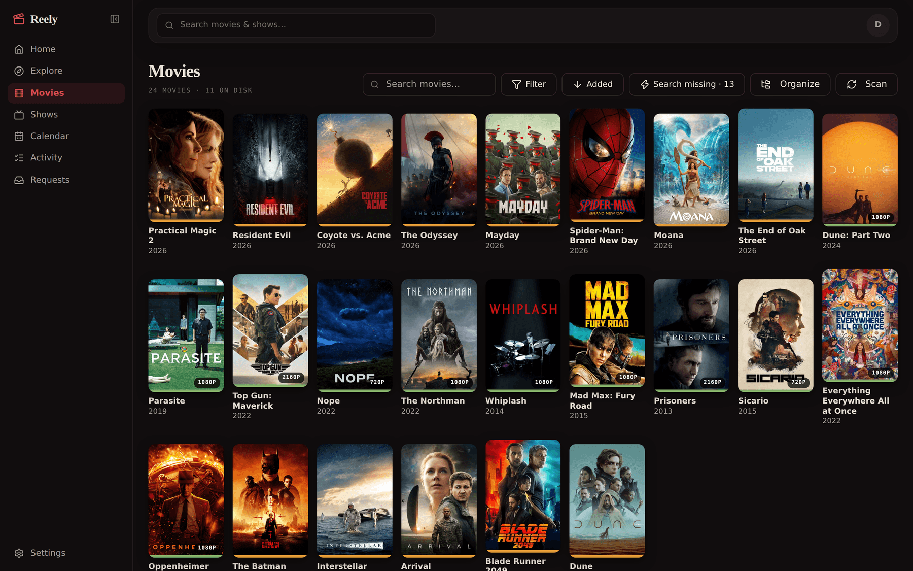
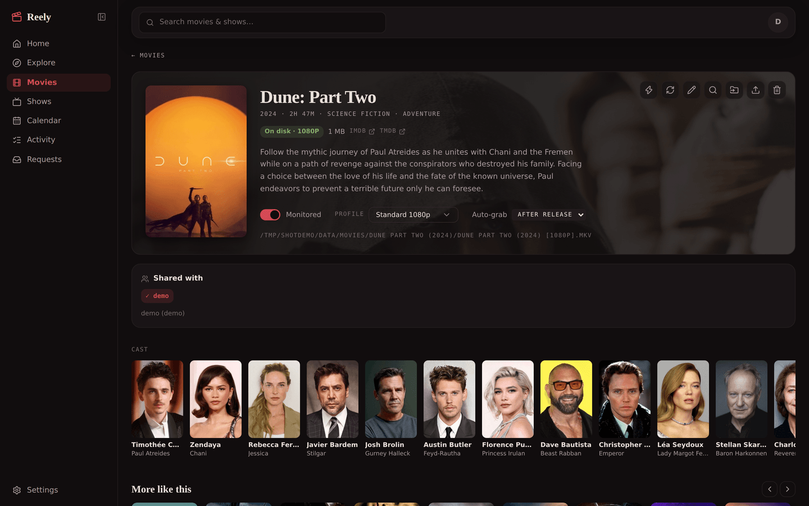
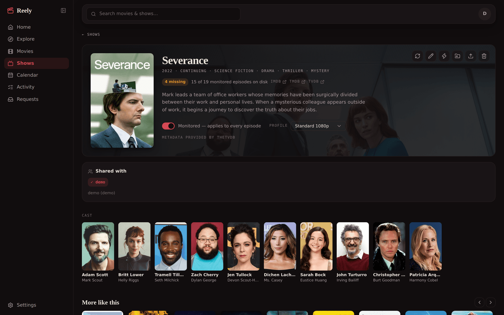
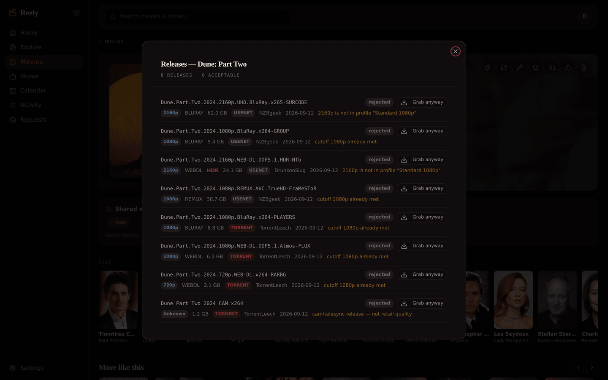
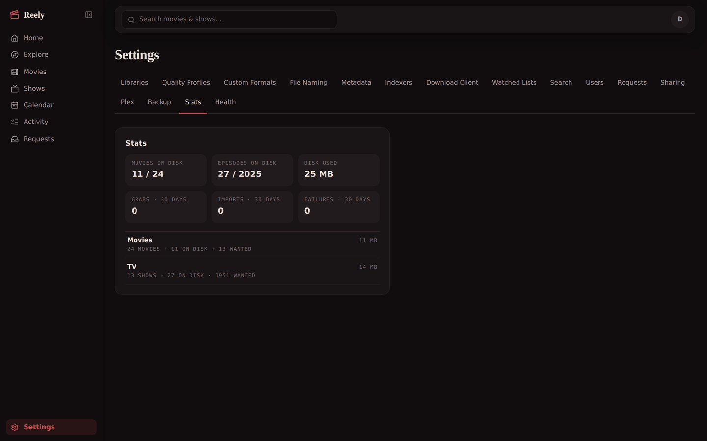
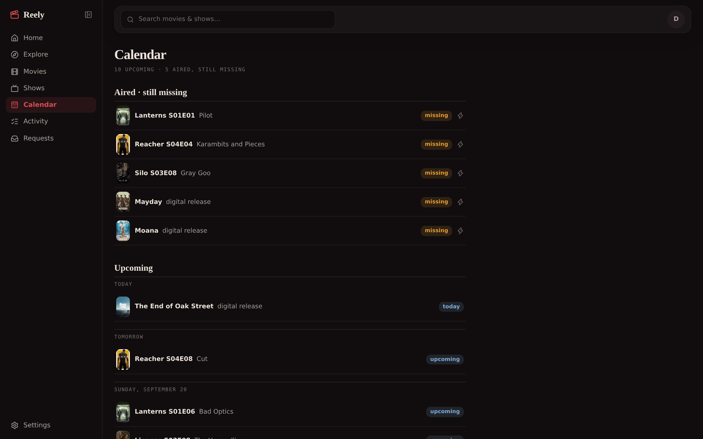
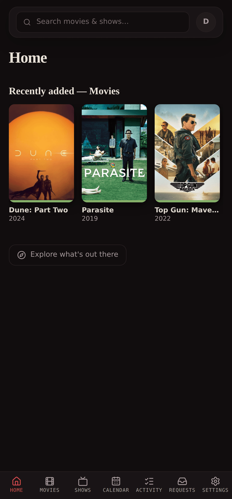

<div align="center">


# Reely

**Movie and TV automation for your screening room.**

Monitor the movies and shows you want, grab them the moment they hit your indexers,
upgrade them until they meet your quality cutoff, and give every person in the house
their own collection — while one file on disk backs every copy. One Docker container,
no external database.




</div>

The full manual lives in [the wiki](https://github.com/getreely/reely/wiki).

## Why

Running Radarr *and* Sonarr means two apps, two configs, two UIs — and neither
knows that your household is more than one person. Add Overseerr for requests
and a labeller to keep Plex in line, and it is four or five services. Reely folds movie and TV
automation into one app and makes collections per-user from the ground up:
everyone gets their own libraries, adding a title someone else already has
lands it instantly, and hardlinks mean a movie in five collections costs disk
once. The whole loop is: add it to your list on your phone, it's on disk
— at the right quality — minutes later.

## A look around

| | |
| :---: | :---: |
|  |  |
| **Every movie, one page** — status, quality, tracks, who it reaches, actions | **Seasons that obey you** — monitor per show, season, or episode |
|  |  |
| **Transparent grabs** — every release judged and labelled usenet or torrent, every rejection explained | **The install at a glance** — libraries, disk, and the loop's last 30 days |
|  |  |
| **Nothing slips** — what's coming next, and what aired and never landed | **...and it's an installable PWA** — the whole app, built for your phone too |

## What you get

- **Per-user collections, one file on disk** — the same title can live in any
  number of libraries; imports hardlink into every collection that wants
  them, adds fill instantly from siblings, upgrades lift every copy, and
  deleting yours never touches anyone else's.
- **The grab loop** — RSS sync against Prowlarr with no date gate (early
  releases get scooped), hourly release-day passes, an opt-in wanted sweep,
  and paced active searches that never hammer your indexers. **Usenet via
  SABnzbd, torrents via qBittorrent** — either alone is a complete setup,
  and running both adds a preference that breaks a tie without ever taking
  a worse release. Search results label every release, and a torrent is
  hard-linked into the library rather than moved, so it keeps seeding.
- **Quality that finishes the job** — per-library profiles with runtime-scaled
  size bands (MB per minute, not flat caps), HDR policies, and **automatic
  upgrades**: a 720p file keeps hunting for 1080p until the cutoff is met,
  the lesser file replaced and cleaned up once nothing references it.
- **Failure handling** — failed downloads are blocklisted from automatic
  re-grabs (manual grab is always an override; removing the entry is the
  pardon), and stuck imports show their reason in Activity with retry and
  hand-resolve right on the row.
- **Watched lists** — TMDB charts and lists, Trakt public lists, and mdblist
  (each user brings their own free key, strictly per-user). Each list feeds a
  library; a public TMDB list makes a free watchlist that syncs from your
  phone to your library.
- **Metadata that stays fresh** — TMDB drives everything, on a tiered refresh:
  continuing shows daily, ended weekly — so a resurrected show gets caught,
  and its new season starts grabbing by itself. People pages give every actor
  a filmography cross-linked to your libraries.
- **TVDB for shows (optional)** — add a free TVDB v4 API key and shows
  search, add, and refresh through TheTVDB: the numbering release groups
  actually use, where a revival continues as one series instead of splitting
  in two the way TMDB lists it. Movies, cast, and discovery stay on TMDB.
  A one-click Settings migration moves an existing library over (manual
  picker for anything ambiguous). Without a key, shows stay on TMDB and a
  per-show season-offset setting covers the split-show cases by hand.
- **Scene numbering (TheXEM)** — where release groups number a show differently
  than TheTVDB does, reely searches by the numbers on the releases. TVDB's
  aired order folds two runs of *Kitchen Nightmares (US)* into one season, so
  its S9 releases as S10; the mapping is fetched per show on refresh, needs no
  key, and the displayed numbering stays TheTVDB's — the same split Sonarr
  makes.
- **Plex sharing, by group** — make groups of the people you share Plex
  with, share a title with a group, and reely keeps Plex's labels in line
  with who should see what. It only ever removes labels it put there, so a
  library you label by hand is left alone.
- **Requests, without a second app** — people you share Plex with sign in
  to the requesting side, search, and ask. Approve or deny from a queue,
  or auto-approve the people you trust — set per person, and separately
  for movies and shows, with weekly quotas so nobody fills a disk
  overnight. No Overseerr, no third service to keep running.
- **Calendar** — upcoming air dates and digital releases, plus what aired and
  is still missing.
- **Users done right** — admin and regular roles, per-library access enforced
  server-side (out-of-scope titles 404), self-service lists, and an
  unauthenticated surface of exactly three endpoints.
- **The boring essentials** — local accounts (bcrypt, sealed credentials with
  the key outside the database), rotating daily backups with validated
  one-click restore, health checks, a stats dashboard, a first-run wizard,
  and multi-select everywhere.

## Run it

```bash
docker run -d --name reely \
  --restart=unless-stopped \
  -p 8788:8788 \
  -e PUID=99 -e PGID=100 -e UMASK=022 \
  -v /mnt/user/appdata/reely:/config \
  -v /mnt/user/data:/data \
  ghcr.io/getreely/reely:latest
```

- **Keep your download clients' completed folders and your library roots
  under the same `/data` mount** — hardlinks only work within one
  filesystem, and they're what make imports instant and collections free.
  This matters doubly for torrents: a torrent is hard-linked so it can keep
  seeding, and where a link cannot be made reely copies, which means the
  file is on disk twice for as long as it seeds.
- **`--restart=unless-stopped` matters**: restoring a backup works by staging
  the file and exiting; Docker bringing the container back applies it.
- **Credentials are encrypted at rest** with a key kept outside the database —
  auto-generated to `/config/secret.key`, or supply your own via
  `-e REELY_SECRET_KEY=<64 hex chars>` (`openssl rand -hex 32`) to keep it out
  of `/config` entirely. A copied database or downloaded backup yields nothing
  usable.

Open `http://<host>:8788` — the wizard walks through the admin account,
libraries, TMDB key, quality profile, Prowlarr, a download client, and
watched lists.
Details in [Getting Started](https://github.com/getreely/reely/wiki/Getting-Started).

### Environment

| Variable | Default | Purpose |
| --- | --- | --- |
| `REELY_PORT` | `8788` | HTTP port |
| `REELY_EXTERNAL_PORT` | — | Second listener carrying the requesting side only, with every admin route absent. Publish this one; see below |
| `REELY_CONFIG_DIR` | `/config` | Database, secret key, backups |
| `REELY_SECRET_KEY` | — | 64-hex-char key for sealing credentials; generated to `/config/secret.key` when unset |
| `REELY_RESTORE_PASSWORD_LOGIN` | — | Set and restart once to give every admin its password back — the way in when Plex sign-in is what broke. Unset it afterwards |
| `PUID` / `PGID` / `UMASK` | `99` / `100` / `022` | File ownership for imports |

### Letting people request from outside

Set `REELY_EXTERNAL_PORT` and reely serves a second listener with the same
app minus every admin route — not refused, absent. Publish that port and
the requesting side is reachable; settings, users, libraries, indexers and
backups are not served there at all.

```bash
docker run -d --name reely \
  -p 8788:8788 \
  -p 8789:8789 -e REELY_EXTERNAL_PORT=8789 \
  ...
```

The set is derived from the level each route already declares, so a route
registered as admin is unreachable from outside by construction rather
than by anybody maintaining an allowlist.

People sign in there with Plex: link your Plex account in Settings → Plex,
and whoever you've shared your server with can sign in and ask for titles.

Linking also ties your Plex account to your own admin account and turns
its password off, so the install has one way in rather than two. If Plex
is ever the thing that breaks, start the container once with
`REELY_RESTORE_PASSWORD_LOGIN=1` to get the password back.
They reach the libraries Plex says they reach — unshare somebody and they
are signed out.

[Tailscale Funnel](https://tailscale.com/kb/1223/funnel) suits this well,
since it publishes one local port:

```bash
tailscale funnel 8789
```

Keep `8788` on the LAN. Funnel needs the node enabled for it in your
tailnet's access controls, and its public side is limited to ports 443,
8443 and 10000.

## Development

```bash
cd web && pnpm install && pnpm build   # frontend → web/dist (embedded)
go build ./cmd/reely                   # backend
```

`go test -race ./...` runs the suite; CI also runs golangci-lint, gitleaks,
govulncheck, and a Trivy image scan. The wiki is sourced from
[`docs/wiki/`](docs/wiki) and republished on every push to main — edit it via
PR, not the wiki UI.

## Metadata sources

- Movie and show metadata, artwork, and people from
  [TMDB](https://www.themoviedb.org). This product uses the TMDB API but is
  not endorsed or certified by TMDB.
- Show metadata optionally provided by [TheTVDB](https://thetvdb.com).
  Please consider adding missing information or subscribing.

## License

GPL-3.0 — see [LICENSE](LICENSE).
